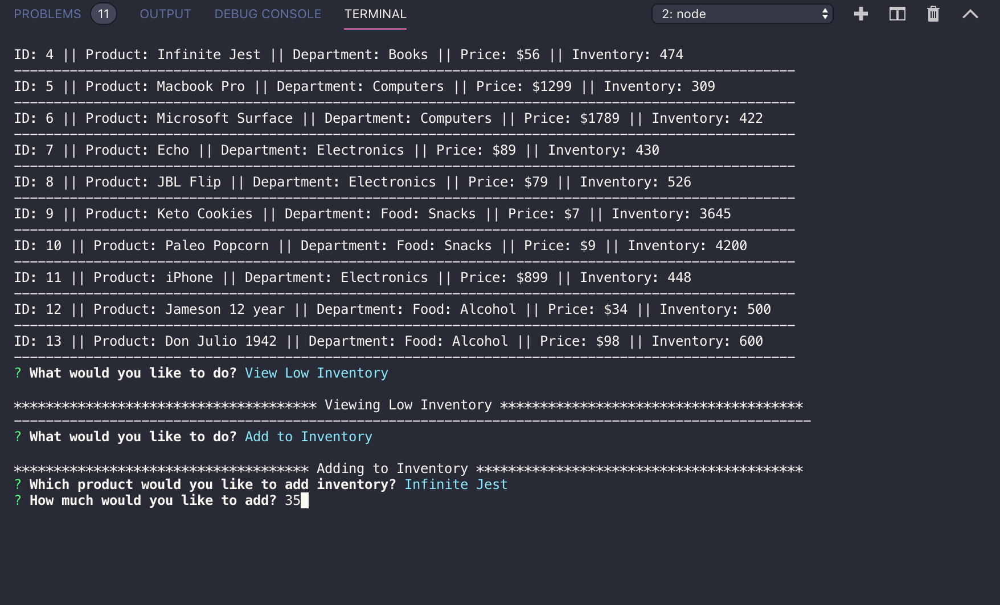

# bamazon

## Overview

The goal of this project was to create an Amazon-like storefront using Node.js and MySQL. The CLI app will take orders from customers and deplete stock from the store's inventory. It will also track product sales across departments and provide a summary of the highest-selling departments in the store.  The store is called BAMAZON.

- - -

### Customer View

1.  The Bamazon CLI app displays the store product selection by ID number.

2.  The customer is asked to enter the product ID number for the product they want to purchase.

3.  The customer is then asked to enter the quantity of the product they would like to purchase.

4.  The app will check to see if there is enough inventory to fulfill the order.  If so, it will calculate the total cost of the order and inform the customer that the items will ship.  It will then ask if they would like to continue shopping.  If the customer says yes it will re-display the product menu and repeat the order process.

5.  However, if there is not enough product in the inventory to fulfiil the order the app will display a message that there is not enough product available to fill the order.  The app will ask the customer if they would like to continue shopping.  If yes, the product menu will display and the order process will repeat.

6.  If at anytime the customer selects that they would not like to continue shopping the app will send a thank you message and exit the system.

- - -

### Manager View

1.  The Bamazon CLI app allows managers to interact with the database.  There is a menu of options for the manager to choose from: View Products for Sale, View Low Inventory, Add to Inventory and Add New Product.

  * If a manager selects `View Products for Sale`, the app displays available products: IDs, names, prices and inventory.

  * If a manager selects `View Low Inventory`, the app will display all products with an inventory count lower than 200.

  * If a manager selects `Add to Inventory`, the app will prompt the manager to add to product inventory.

  * If a manager selects `Add New Product`, the app will allow the manager to add a completely new product.

- - -

### Supervisor View

1. The Bamazon CLI app allows supervisors to interact with the database.  There is a menu of options for the manager to choose from: View Product Sales by Department and Create a New Department.

   * If a supervisor selects `View Product Sales by Department`, the app will display a summarized table showing the sales information (department information, overhead costs, sales and profit.

- - -

## Screenshots

### MySql Test Connection

### Product Menu Code

### Product Menu Display

### Customer UI/UX

### Manager UI/UX

### Supervisor UI/UX

- - -
